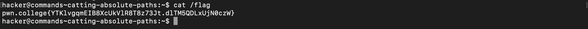
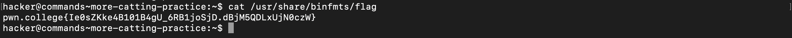
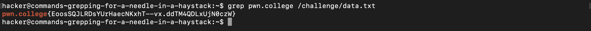

# Comprehending Commands

### Cat
`cat` short for concatenate, is to merge multiple files (or single file) and then to stream it to standard outputs.

### Catting absolute paths
Similar to the previous challenge, this time we'll invoke the `cat` command with `/flag` (which is an absolute path) as it's argument.

  
### More catting practice
Exactly the same as previous challenge, except this time the absolute path is `/usr/share/binfmts/flag`

### Grepping
Every pwn college flag begins with a `pwn.college{` boiler, we can use it as a base for our search and subsequently provide it as our first argument, the second argument is the absolute path to the file.

### Listing files
### Touching files
### Removing files
### Hidden files

### An epic filesystem quests