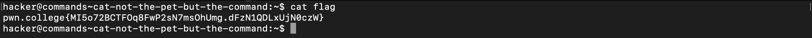

# Comprehending Commands

### Cat
`cat` short for concatenate, is to merge multiple files (or single file) and then to stream it to standard outputs.

### Catting absolute paths

### More catting practice
### Grepping
### Listing files
### Touching files
### Removing files
### Hidden files

### An epic filesystem quests