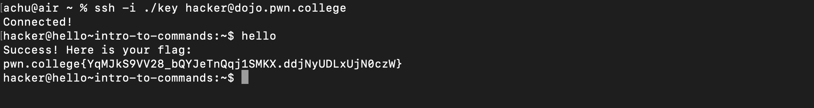
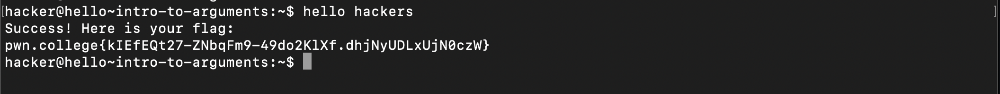

# Hello Hackers

### Intro to Commands
The challenges requires us to enter the comamnd `hello`, and that's it!

### Intro to Arguments
Similar to the first challenge except this time we are required to give the argument `hackers` to the `hello` command.
