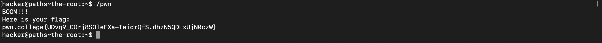
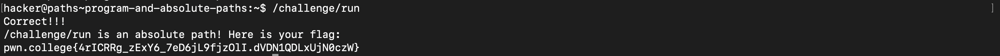

# Pondering Paths

### The Root
There's a program called `pwn` being contained at root (`/`), we need to invoke it in order to complete the challenge. The path in this case is absolute instead of relative because terminal is positoned at root.

### Program and Absolute Path
Similar to the previous challenge, we'll invoke the `run` that is being nested inside `challenge`.

### Position thy self
---